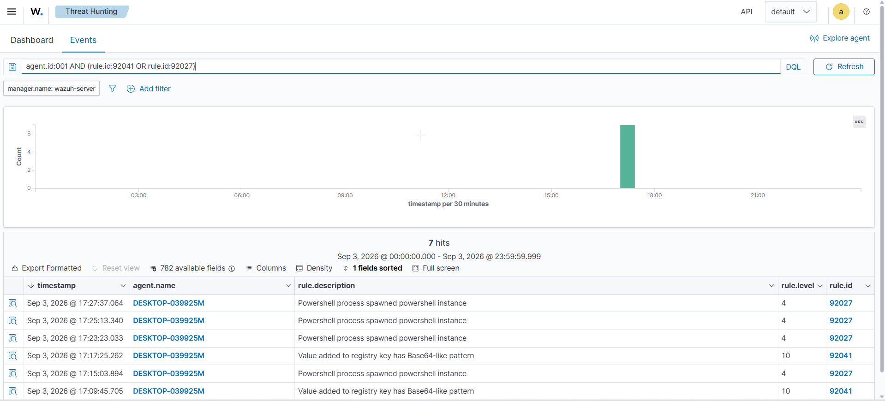
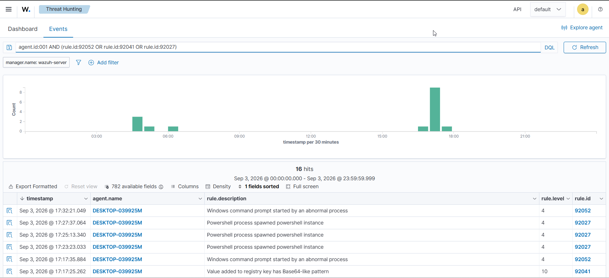
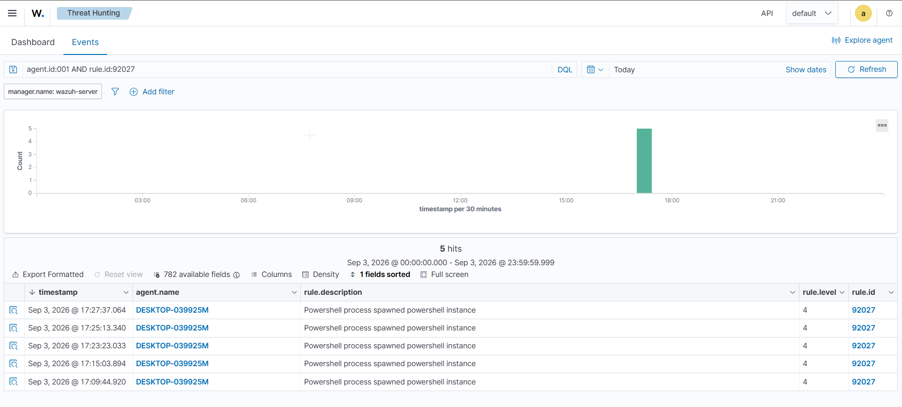
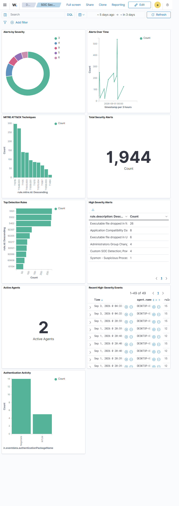

# Security Operations Center (SOC) Lab Using Wazuh, Sysmon & MITRE ATT&CK

An isolated VMware SOC lab demonstrating **security monitoring, detection, alert investigation, event correlation, MITRE ATT&CK mapping, custom detection engineering, incident response, automated response execution, and SOC dashboard visualization.**


---

## Project Overview

This project implements a small-scale Security Operations Center (SOC) environment using:

- **Wazuh** — Security monitoring, detection, analysis and visualization
- **Sysmon** — Windows endpoint telemetry
- **Windows 11** — Monitored SOC endpoint
- **Kali Linux** — Controlled security testing
- **MITRE ATT&CK** — Adversary technique mapping
- **VMware** — Isolated virtualization environment

The project follows an end-to-end SOC workflow:

```text
Controlled Activity
       ↓
Endpoint Telemetry
       ↓
Wazuh Detection
       ↓
Alert Investigation
       ↓
Event Correlation
       ↓
MITRE ATT&CK Mapping
       ↓
Investigative Log Queries
       ↓
Incident Response
       ↓
Active Response
       ↓
SOC Dashboard
```

---

## Lab Architecture

The lab was designed as an isolated virtual SOC environment using VMware.

### Components

| Component | Role |
|-----------|------|
| **Wazuh Server** | Central security monitoring, analysis and visualization |
| **Windows 11 Endpoint** | Monitored endpoint generating Windows Security and Sysmon telemetry |
| **Kali Linux** | Controlled security testing |
| **VMware** | Isolated virtualization environment |

### Architecture


---

## Security Telemetry

The Windows endpoint was configured with both **Wazuh Agent** and **Sysmon** to provide endpoint security telemetry.

### Windows Security Events

| Event ID | Activity |
|----------|----------|
| **4625** | Failed logon |
| **4720** | User account creation |
| **4732** | Security-enabled local group membership change |

### Sysmon Events

| Event ID | Activity |
|----------|----------|
| **1** | Process Create |
| **11** | File Create |

This telemetry was collected by the Wazuh Agent and analyzed through the Wazuh platform.

---

## Detection Scenarios

Controlled suspicious activity was generated against the Windows endpoint to validate detection capabilities.

The project demonstrated detection of:

- PowerShell execution
- PowerShell `ExecutionPolicy Bypass` (observed, not specifically detected by custom rule)
- Suspicious file creation
- Executable file activity
- Windows account creation
- Administrator group modification
- Failed authentication
- Process creation
- File creation

### Relevant Wazuh Rules

| Rule ID | Detection |
|---------|-----------|
| **92029** | PowerShell executed from a suspicious location |
| **92207** | Executable file dropped in Users\Public folder |
| **92213** | Executable file dropped in a folder commonly used by malware |
| **100100** | Custom SOC Detection: PowerShell execution activity |

---

## Atomic Red Team Validation

Atomic Red Team was used to validate the Wazuh detection pipeline with controlled and reversible security tests on the Windows endpoint.

Three Atomic Red Team tests were executed:

| Atomic Test | Technique | Result | Wazuh Evidence |
|-------------|-----------|--------|----------------|
| T1059.001-10 | PowerShell | Successful | Rules 92041, 92027 |
| T1112-1 | Modify Registry | Successful | Rules 92052, 92041, 92027 |
| T1059.001-11 | NTFS Alternate Data Stream Access | Successful | Rule 92027 |

### Test 1 — PowerShell Fileless Script Execution

The test generated PowerShell and registry activity and successfully created a temporary marker file.

Wazuh detected the resulting activity through:

- **92041** — Value added to registry key has Base64-like pattern
- **92027** — Powershell process spawned powershell instance



### Test 2 — Modify Registry

The test performed a controlled modification to the current user's registry profile.

Wazuh recorded related activity through:

- **92052** — Windows command prompt started by an abnormal process
- **92041** — Value added to registry key has Base64-like pattern
- **92027** — Powershell process spawned powershell instance



### Test 3 — NTFS Alternate Data Stream Access

The test created and executed a harmless NTFS Alternate Data Stream.

The Atomic test completed successfully, but a direct Sysmon Event ID 15 match was not observed in Wazuh. Wazuh did record associated PowerShell process activity through Rule 92027.



### Validation Result

The Atomic Red Team tests demonstrated that controlled adversary-simulation activity generated endpoint telemetry that was subsequently collected and analyzed by Wazuh.

The results also identified a detection-coverage gap for direct NTFS Alternate Data Stream telemetry, providing a potential area for future detection engineering.

[Detailed Atomic Red Team Validation](documentation/atomic-red-team-validation.md)

---

## SOC Investigation

The detected activity was investigated using Wazuh alerts, Windows Security logs, and Sysmon telemetry.

### Investigation Case: Suspicious PowerShell Execution

| Attribute | Detail |
|-----------|--------|
| **Alert Triggered** | August 30, 2026 at 14:23:12 |
| **Endpoint** | WIN11-SOC |
| **Rule** | 92029 — PowerShell from suspicious location |
| **MITRE Mapping** | T1059.001 — Command and Scripting Interpreter: PowerShell |

**Investigation Steps:**

1. Opened the alert in Wazuh Dashboard and reviewed the raw JSON:

```json
"win.eventdata.commandLine": "powershell -c Write-Host 'SOC Lab Test'"
```

2. Confirmed the process was `powershell.exe` (PID 1234), spawned by `cmd.exe`.

3. Searched for other PowerShell activity on the same endpoint:

```
data.win.eventdata.commandLine: "*PowerShell*" AND agent.name: "WIN11-SOC"
```

4. Identified 47 events, 3 with similar patterns.

5. Determined the activity was generated from Kali Linux as part of controlled testing.

**Conclusion:** The Wazuh detection pipeline successfully captured and alerted on PowerShell execution. The activity was validated as a controlled test.

---

## Event Correlation

Multiple related security events were correlated into a single incident timeline rather than being treated as isolated alerts.

The observed activity included:

```text
Account Creation (4720)
        ↓
Administrator Group Modification (4732)
        ↓
Failed Authentication (4625)
        ↓
PowerShell Activity
        ↓
File Activity
        ↓
Wazuh Detection
        ↓
Investigation
```

This demonstrated how multiple endpoint events can provide greater context when investigated together.

---

## Investigative Log Queries

Ad-hoc log queries were performed using Wazuh event data and endpoint telemetry to validate detection coverage.

Queries included:

```text
ExecutionPolicy Bypass
C:\Users\Public\*.ps1
Sysmon Event ID 1
Sysmon Event ID 11
Windows Security Event ID 4625
Windows Security Event ID 4720
Windows Security Event ID 4732
```

The objective was to verify that specific telemetry was being collected and was searchable.

---

## Custom Detection Engineering

A custom Wazuh detection rule was developed to generate higher-severity alerts for PowerShell activity.

### Custom Rule

| Property | Value |
|----------|-------|
| **Rule ID** | `100100` |
| **Severity** | `12` |
| **Parent Rule** | `92029` |
| **Detection** | PowerShell execution activity |
| **MITRE ATT&CK** | `T1059.001` |

The custom rule was successfully tested and generated Wazuh alerts during controlled PowerShell execution.

### Rule Configuration

```xml
<group name="local,windows,powershell,">
  <rule id="100100" level="12">
    <if_sid>92029</if_sid>
    <description>Custom SOC Detection: PowerShell execution activity</description>
    <mitre>
      <id>T1059.001</id>
    </mitre>
  </rule>
</group>
```

[View the complete custom rule](detection-rules/local_rules.xml)

---

## MITRE ATT&CK Mapping

Observed activities were mapped to relevant MITRE ATT&CK techniques based on the telemetry and Wazuh detections generated during the lab.

### Demonstrated Techniques

| Activity | Technique | ID |
|----------|-----------|-----|
| PowerShell execution | Command and Scripting Interpreter: PowerShell | **T1059.001** |
| Suspicious executable/file activity | Ingress Tool Transfer | **T1105** |
| Windows account creation | Create Account: Local Account | **T1136.001** |
| Administrator group modification | Account Manipulation | **T1098** |
| Failed authentication | Brute Force | **T1110** |

### Key Technique — T1059.001

**Command and Scripting Interpreter: PowerShell**

PowerShell activity was detected through endpoint telemetry and Wazuh detection rules. The custom rule `100100` generated higher-severity alerts for PowerShell execution.

[View MITRE ATT&CK mapping](mitre/mitre-mapping.md)

---

## Incident Response

A controlled incident response process was performed after detection.

### Response Actions

- Disabled the test account `Phase4SOC`
- Removed the test account from the local Administrators group
- Removed temporary suspicious PowerShell test files
- Preserved relevant Wazuh and Sysmon telemetry
- Verified that the Wazuh Agent remained connected to the Wazuh Server

### Verification Commands

```cmd
net user Phase4SOC
net localgroup Administrators
```

The response process demonstrated basic SOC containment and recovery activities within the isolated environment.

[View Incident Response documentation](incident-response/incident-response.md)

---

## Active Response

A custom Wazuh Active Response was configured for the custom detection rule `100100`.

### Response Workflow

```text
Wazuh Alert
     ↓
Custom Rule 100100
     ↓
Active Response
     ↓
SOC_ActiveResponse.cmd
     ↓
SOC_ActiveResponse.ps1
     ↓
Response Execution
     ↓
Verification
```

The Windows endpoint executed the custom response script when the custom detection rule was triggered.

The response was verified by creating:

```
C:\Users\Public\SOC_ActiveResponse_Result.txt
```

The result file confirmed successful execution of the Active Response.

The implementation was intentionally **non-destructive** and designed for safe validation within the isolated SOC lab.

---

## SOC Dashboard

A custom Wazuh dashboard named **SOC Security Operations Dashboard** was created to provide a centralized view of security activity.

### Dashboard Panels

1. **Total Security Alerts**
2. **Alerts by Severity**
3. **Alerts Over Time**
4. **MITRE ATT&CK Techniques**
5. **Top Detection Rules**
6. **High Severity Alerts**
7. **Active Agents**
8. **Recent High-Severity Events**
9. **Authentication Activity**



The dashboard provides a consolidated SOC view for alert volume, severity, detection rules, MITRE ATT&CK techniques, authentication activity, and recent high-severity events.

---

## Project Evidence

The following screenshots document the major stages of the project:

| Evidence | Description |
|----------|-------------|
| [Lab Architecture](screenshots/01-lab-architecture.png) | Isolated VMware SOC lab architecture |
| [Wazuh Agent](screenshots/02-wazuh-agent.png) | Wazuh Agent service verification |
| [Sysmon Process Create](screenshots/03-sysmon-process-create.png) | Sysmon Event ID 1 process creation telemetry |
| [Sysmon File Create](screenshots/04-sysmon-file-create.png) | Sysmon Event ID 11 file creation telemetry |
| [Authentication Detection](screenshots/05-authentication-detection.png) | Windows authentication and account activity |
| [PowerShell Detection](screenshots/06-powershell-detection.png) | Wazuh PowerShell detection |
| [File Detection](screenshots/07-file-detection.png) | Suspicious executable/file detection |
| [MITRE ATT&CK](screenshots/08-mitre.png) | MITRE ATT&CK PowerShell mapping |
| [Investigation & Correlation](screenshots/09-investigation-correlation.png) | Correlated security alerts |
| [Custom Detection](screenshots/10-custom-rule.png) | Custom Wazuh Rule 100100 |
| [Active Response](screenshots/11-active-response.png) | Active Response execution verification |
| [Final SOC Dashboard](screenshots/12-final-dashboard.png) | Completed SOC dashboard |
| [Atomic PowerShell Detection](screenshots/13-atomic-powershell-wazuh.png) | Atomic Red Team T1059.001 PowerShell validation |
| [Atomic Registry Detection](screenshots/14-atomic-registry-wazuh.png) | Atomic Red Team T1112 registry validation |
| [Atomic ADS Detection](screenshots/15-atomic-ads-wazuh.png) | Atomic Red Team T1059.001 ADS validation |

---

## Repository Structure

```text
wazuh-soc-lab/
│
├── README.md
│
├── architecture/
│   └── architecture-diagram.png
│
├── screenshots/
│   ├── 01-lab-architecture.png
│   ├── 02-wazuh-agent.png
│   ├── 03-sysmon-process-create.png
│   ├── 04-sysmon-file-create.png
│   ├── 05-authentication-detection.png
│   ├── 06-powershell-detection.png
│   ├── 07-file-detection.png
│   ├── 08-mitre.png
│   ├── 09-investigation-correlation.png
│   ├── 10-custom-rule.png
│   ├── 11-active-response.png
│   ├── 12-final-dashboard.png
│   ├── 13-atomic-powershell-wazuh.png
│   ├── 14-atomic-registry-wazuh.png
│   └── 15-atomic-ads-wazuh.png
│
├── detection-rules/
│   └── local_rules.xml
│
├── documentation/
│   └── SOC_Lab_Final_Report.md
│
├── incident-response/
│   └── incident-response.md
│
└── mitre/
    └── mitre-mapping.md
```

---

## Project Results

The project successfully demonstrated an end-to-end SOC workflow:

- ✅ Wazuh Server deployment
- ✅ Windows Wazuh Agent integration
- ✅ Sysmon endpoint telemetry
- ✅ Windows Security event monitoring
- ✅ Suspicious PowerShell detection
- ✅ Suspicious file activity detection
- ✅ Account activity investigation
- ✅ Event correlation
- ✅ MITRE ATT&CK mapping
- ✅ Custom Wazuh detection engineering
- ✅ Incident response
- ✅ Wazuh Active Response
- ✅ SOC dashboard creation
- ✅ Atomic Red Team detection validation

The lab provided practical experience across **security monitoring, detection, investigation, detection engineering, incident response, and automated response execution**.

---

## Lessons Learned

| Area | Lesson |
|------|--------|
| Detection Engineering | A custom rule is only as effective as its specific logic. Rule `100100` inherited from `92029`, making it a broad PowerShell detection rather than a precise `ExecutionPolicy Bypass` detection. |
| Validation | Atomic Red Team is useful for identifying detection gaps, such as the NTFS ADS coverage gap. |
| Investigation | Correlating multiple events (account creation + group modification + PowerShell) provides more context than isolated alerts. |
| Visibility | Sysmon provides significantly more telemetry than Windows Security logs alone. |

---

## Scope & Limitations

This project was developed as an **isolated cybersecurity training environment**.

The lab has several limitations:

- Small number of endpoints
- Primarily Windows endpoint telemetry
- Controlled rather than real-world attack activity
- Limited network-level visibility
- Non-destructive automated response
- No production infrastructure was involved

---

## Future Improvements

Potential future enhancements include:

- Integrating **Zeek** or **Suricata** for network monitoring
- Adding additional Windows and Linux endpoints
- Expanding custom Wazuh detection rules
- Integrating threat intelligence feeds
- Building more advanced event correlation
- Expanding automated response capabilities
- Adding case management and incident tracking
- Simulating additional controlled attack scenarios
- Developing more advanced SOC dashboards

---

## Documentation

### Detailed Project Report

[SOC Lab Final Report](documentation/SOC_Lab_Final_Report.md)

### Incident Response

[Incident Response Documentation](incident-response/incident-response.md)

### MITRE ATT&CK Mapping

[MITRE ATT&CK Mapping](mitre/mitre-mapping.md)

### Custom Detection Rule

[Wazuh Custom Rule](detection-rules/local_rules.xml)

### Atomic Red Team Validation

[Atomic Red Team Validation](documentation/atomic-red-team-validation.md)

---

## Security & Privacy

This public repository intentionally avoids exposing sensitive lab information.

Private network addressing in public diagrams has been masked, and no passwords, API tokens, private keys, or other credentials are included.

---

## Disclaimer

This project was created strictly for **educational and defensive cybersecurity training purposes**.

All suspicious activity was intentionally controlled and performed within an isolated virtual lab environment.

No unauthorized systems or networks were targeted.
