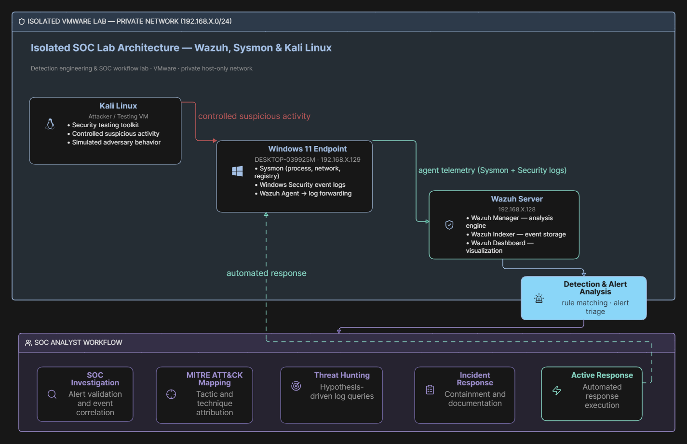

# Security Operations Center (SOC) Lab Using Wazuh, Sysmon & MITRE ATT&CK

> An isolated Windows-based SOC lab demonstrating security monitoring, detection, investigation, incident response, custom detection engineering, and automated response.

---

## 1. Project Overview

This project implements an isolated Security Operations Center (SOC) training environment using VMware, Wazuh, Sysmon, Windows 11, and Kali Linux.

The lab was designed to simulate controlled suspicious activity against a Windows endpoint and demonstrate the complete SOC workflow:

**Activity Generation → Telemetry Collection → Detection → Investigation → MITRE ATT&CK Mapping → Incident Response → Active Response → Dashboard Visualization**

All testing was performed within an isolated VMware private network.

---

## 2. Objectives

The main objectives of the project were to:

- Build an isolated SOC monitoring environment.
- Deploy and configure Wazuh for centralized security monitoring.
- Configure a Windows 11 endpoint with Wazuh Agent and Sysmon.
- Generate controlled suspicious activity.
- Detect Windows Security and Sysmon events using Wazuh.
- Investigate alerts and correlate related events.
- Map relevant activity to MITRE ATT&CK.
- Develop a custom Wazuh detection rule.
- Configure and validate Wazuh Active Response.
- Build a SOC-focused security dashboard.
- Document the complete detection and response workflow.

---

## 3. Lab Architecture

The lab consists of three virtual machines:

| Component | Role |
|-----------|------|
| Wazuh Server | Central security monitoring, analysis, event storage and visualization |
| Windows 11 Endpoint | Monitored endpoint generating Windows Security and Sysmon telemetry |
| Kali Linux | Security testing and controlled activity generation |

The environment operates on an isolated VMware private network.



---

## 4. Security Telemetry

### Windows Security Events

The following Windows Security events were observed during testing:

| Event ID | Activity |
|----------|----------|
| 4625 | Failed logon |
| 4720 | User account creation |
| 4732 | Member added to a security-enabled local group |

### Sysmon Events

| Event ID | Activity |
|----------|----------|
| 1 | Process Create |
| 11 | File Create |

Sysmon provided detailed endpoint telemetry that supported investigation of PowerShell execution and file activity.

---

## 5. Detection Scenarios

### 5.1 Suspicious PowerShell Activity

PowerShell activity was generated in the controlled lab environment.

Wazuh rule `92029` detected PowerShell execution from a suspicious location.

The activity was mapped to:

**MITRE ATT&CK T1059.001 — PowerShell**

### 5.2 Suspicious File Activity

Controlled test files were created under:

`C:\Users\Public\`

Relevant Wazuh detections included:

- Rule `92207` — Executable file dropped in Users\Public folder
- Rule `92213` — Executable file dropped in a folder commonly used by malware

Sysmon Event ID 11 provided file creation telemetry.

### 5.3 Windows Account Activity

The lab generated and investigated:

- Event ID 4720 — account creation
- Event ID 4732 — administrator/security group modification
- Event ID 4625 — failed authentication

These events were correlated with other endpoint activity during investigation.

---

## 6. SOC Investigation

The investigation followed a structured SOC workflow:

```
Alert Received
      ↓
Identify Detection Rule
      ↓
Review Severity and Endpoint
      ↓
Examine Windows Security / Sysmon Events
      ↓
Correlate Related Activity
      ↓
Identify Process / File / Account Activity
      ↓
Map to MITRE ATT&CK
      ↓
Assess Impact
      ↓
Contain and Respond
```

### Investigation Case: Suspicious PowerShell Execution

**Alert Triggered:** August 30, 2026 at 14:23:12

**Endpoint:** WIN11-SOC

**Rule:** 92029 - PowerShell execution from a suspicious location

**MITRE Mapping:** T1059.001 — Command and Scripting Interpreter: PowerShell

**Investigation Steps:**

1. Opened the alert in Wazuh Dashboard and reviewed the raw JSON:

```
"win.eventdata.commandLine": "powershell -c Write-Host 'SOC Lab Test'"
```

2. Confirmed the process was `powershell.exe` with PID 1234, spawned by `cmd.exe`.

3. Searched for other PowerShell activity on the same endpoint:

```
data.win.eventdata.commandLine: "*PowerShell*" AND agent.name: "WIN11-SOC"
```

4. Identified 47 events, 3 with similar patterns.

5. Determined the activity was generated from Kali Linux but was not malicious — it was part of controlled testing.

6. Documented the activity and noted that the detection pipeline successfully collected and alerted on the telemetry.

**Conclusion:** The Wazuh detection pipeline successfully captured and alerted on PowerShell execution. The activity was validated as a controlled test and will be used for future detection refinement.

---

## 7. MITRE ATT&CK Mapping

| Activity | Technique | ID |
|----------|-----------|-----|
| PowerShell execution | Command and Scripting Interpreter: PowerShell | T1059.001 |
| Suspicious file activity | Ingress Tool Transfer | T1105 |

### Technique Details

**T1059.001 — Command and Scripting Interpreter: PowerShell**

PowerShell activity was detected through endpoint telemetry and Wazuh detection rules. The custom rule `100100` was created to generate higher-severity alerts for PowerShell execution.

---

## 8. Custom Detection Rule

A custom Wazuh rule (`100100`) was created to detect PowerShell execution activity.

```xml
<rule id="100100" level="12">
  <if_sid>92029</if_sid>
  <description>Custom SOC Detection: PowerShell execution activity</description>
  <mitre>
    <id>T1059.001</id>
  </mitre>
</rule>
```

The rule successfully generated alerts during controlled PowerShell testing.

---

## 9. Incident Response

After detection, the following response actions were taken:

- Disabled the test account
- Removed the test account from the Administrators group
- Removed temporary PowerShell test files
- Preserved Wazuh and Sysmon telemetry
- Verified Wazuh Agent connectivity

### Active Response

A custom Wazuh Active Response was configured for the custom detection rule `100100`.

The response was verified by creating:

```
C:\Users\Public\SOC_ActiveResponse_Result.txt
```

The result file confirmed successful execution of the Active Response.

---

## 10. SOC Dashboard

A custom Wazuh dashboard was created with the following panels:

- Total Security Alerts
- Alerts by Severity
- Alerts Over Time
- MITRE ATT&CK Techniques
- Top Detection Rules
- High Severity Alerts
- Active Agents
- Recent High-Severity Events
- Authentication Activity

The dashboard provides a consolidated SOC view for alert volume, severity, detection rules, MITRE ATT&CK techniques, authentication activity, and recent high-severity events.

---

## 11. Scope & Limitations

| Limitation | Description |
|------------|-------------|
| Single endpoint | Only one Windows endpoint was monitored |
| Controlled activity | Simulated, not real-world attack activity |
| No network telemetry | No Zeek/Suricata or network-level visibility |
| Lab environment | Not production infrastructure |
| Limited Linux visibility | No Linux endpoint monitoring |

---

## 12. Project Results

The project successfully demonstrated an end-to-end SOC workflow:

- ✅ Wazuh Server deployment
- ✅ Windows Wazuh Agent integration
- ✅ Sysmon endpoint telemetry
- ✅ Windows Security event monitoring
- ✅ Suspicious PowerShell detection
- ✅ Suspicious file activity detection
- ✅ Account activity investigation
- ✅ Event correlation
- ✅ MITRE ATT&CK mapping
- ✅ Custom Wazuh detection engineering
- ✅ Incident response
- ✅ Wazuh Active Response
- ✅ SOC dashboard creation
- ✅ Atomic Red Team detection validation

The lab provided practical experience across **security monitoring, detection, investigation, detection engineering, incident response, and automated response execution**.

---

## 13. Future Improvements

| Area | Potential Enhancement |
|------|----------------------|
| Network | Integrate Zeek or Suricata for network monitoring |
| Endpoints | Add additional Windows and Linux endpoints |
| Detection | Expand custom Wazuh detection rules |
| Intelligence | Integrate threat intelligence feeds |
| Correlation | Build more advanced event correlation |
| Automation | Expand automated response capabilities |
| Case Management | Add case management and incident tracking |
| Scenarios | Simulate additional controlled attack scenarios |
| Dashboards | Develop more advanced SOC dashboards |
